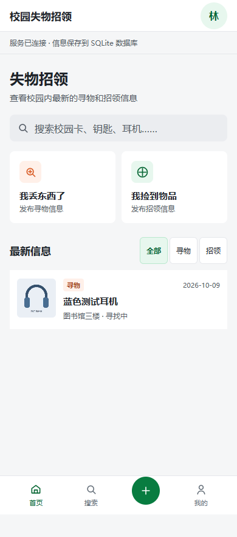
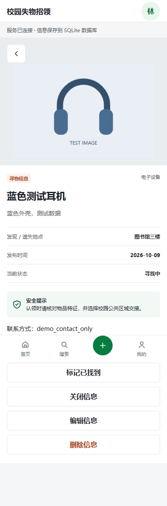

# 校园失物招领

校园寻物与招领 Web 应用。实现发布、浏览、组合搜索、详情、照片上传与放大、联系方式复制、我的发布、编辑、删除、关闭和完成状态。

## 两种运行方式

| 方式 | 保存位置 | 可共享性 |
| --- | --- | --- |
| Python 正式功能版本 | SQLite 数据库 | 同一服务的不同浏览器可查看信息，管理操作在服务端校验 |
| [GitHub Pages 在线体验](https://lll-1121.github.io/campus-lost-found-prototype/) | 当前浏览器 localStorage | 只在此浏览器保存，不能跨设备共享，不是线上数据库服务 |

生产代码无第三方依赖。Python 版本需要 Python 3.10+，推荐 Edge 或 Chrome。

```powershell
python server.py
```

打开 http://127.0.0.1:8765/ 。首次启动自动创建 lostfound.db；正式版本初始为空，请先发布一条信息。刷新和重启服务不会丢失数据。不要用 python -m http.server 启动正式版本，它没有 API。

自定义服务端口或数据库：

```powershell
python server.py --port 8766 --database my-data.db
```

双击 index.html 也可体验静态版本。它与 Pages 一样仅保存在当前浏览器。公开体验请使用虚构联系方式。

## 操作与验收

1. 发布：选择寻物或招领，填写名称、类别、地点、日期、描述、联系方式。可选最多6张 JPG/PNG/WebP 照片，每张原图最多10MB，自动压缩。
2. 搜索：关键词、类型、类别、地点和起止日期可组合。日期边界包含当天，开始晚于结束会提示。
3. 详情：横向查看照片，点击放大，Esc关闭；复制联系方式失败时可手动选择复制。
4. 我的发布：详情中可编辑、删除、关闭、重新公开、标记已找到/已归还或恢复未完成。删除前确认。
5. 已关闭或已完成信息从公共列表隐藏，本人列表保留；关闭与完成是独立状态。
6. 两个浏览器连接同一 Python 服务：A发布，B刷新可看到；B无法编辑删除A的信息。
7. 图片与文本保存到同一SQLite记录，刷新、重启服务后仍然保留。

## 身份与使用边界

浏览器首次访问生成随机发布者凭证，保存在 localStorage；服务端保存 SHA-256 摘要，写操作验证原记录所属凭证。无真实姓名认证、账号密码或凭证找回；清除浏览器数据后将失去管理旧信息的凭证。前端隐藏按钮不代替服务端鉴权。

这是课程演示应用，默认只监听本机。对外部署需要提供实际服务器及HTTPS，并进一步配置限流、备份、内容审核与账号恢复。Python内置HTTP服务不作为高负载生产服务。

## API

请求使用 JSON；写操作带 X-Owner-Token。不要分享这个凭证。

| 方法 | 路径 | 用途 |
| --- | --- | --- |
| GET | /api/items | 读取信息，按当前凭证标记 mine |
| POST | /api/items | 创建，返回201 |
| PUT | /api/items/{id} | 修改字段和状态，只有发布者可操作 |
| DELETE | /api/items/{id} | 删除，只有发布者可操作 |

非法字段返回400，缺少凭证401，越权403，不存在404，请求过大413。静态服务仅公开页面与脚本，不公开数据库和Python源码。请求上限8MB，图片限制6张。

## 测试

后端使用 Python 标准库 unittest：

```powershell
python tests/test_api.py
```

浏览器端测试需要 Node.js、Playwright、已安装的 Edge：

```powershell
npm install --no-save --package-lock=false playwright
node tests/regression.cjs
```

测试自动启动18765端口并使用临时数据库，结束后停止自己的测试服务，不修改正式数据库。结果分别保存在 tests/api-results.json 和 tests/results.json。

最新结果：14项API测试、15项浏览器回归全部通过；覆盖持久化、跨浏览器权限、照片、编辑、关闭/完成、删除、日期范围、异常请求及320/390/768/1440宽度。未做手机真机测试。

## 文件与报告

- server.py：Python API、SQLite、鉴权、字段和图片验证。
- index.html / style.css / app.js：页面、交互与两种数据连接方式。
- tests/：测试脚本和实际结果。
- images/：实际运行截图，上传测试图片为程序绘制的耳机示意图。
- [项目报告](项目报告.md) / [博客园Markdown草稿](博客园博文草稿.md)。
- [协作指南](CONTRIBUTING.md)：当前林彦羽（052404129）独立完成，Codex辅助。真实协作者可fork后发PR。




