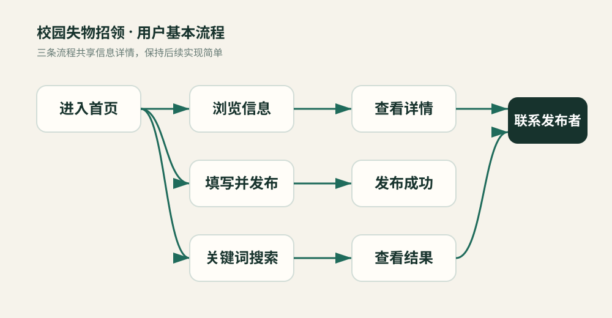
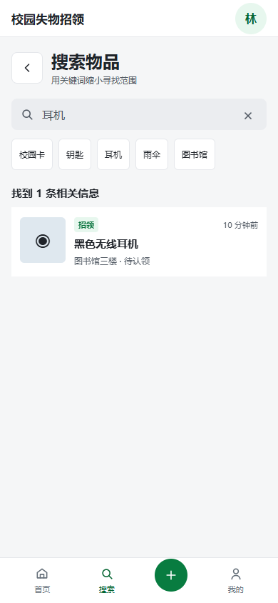
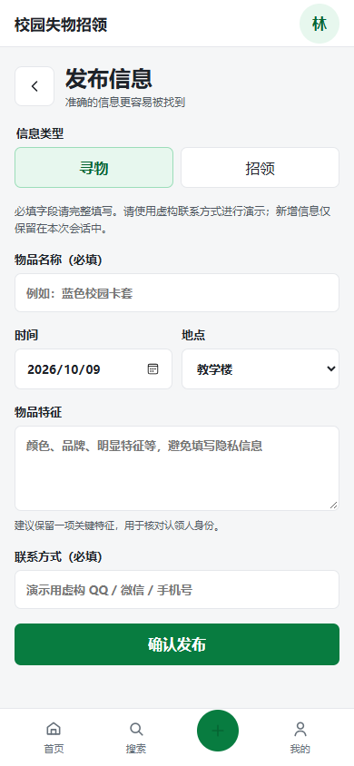
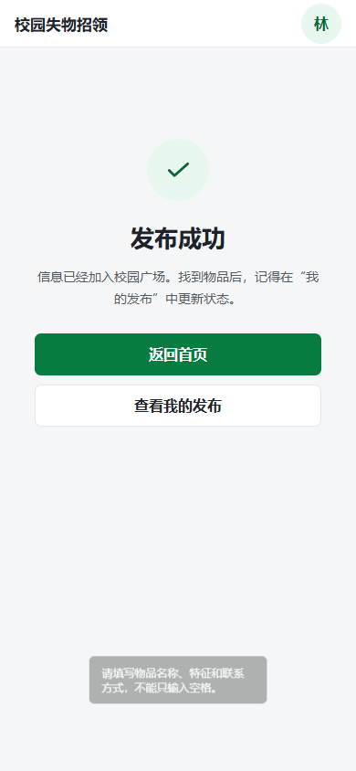
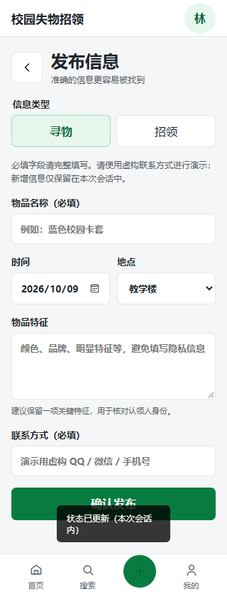

| 项目内容 | 说明 |
| --- | --- |
| 这个作业属于哪个课程 | [2026 秋软件工程](https://edu.cnblogs.com/campus/fzu/2026-01SoftwareEngineeringandSoftwareEngineeringPractice) |
| 这个作业要求在哪里 | [作业页面](https://edu.cnblogs.com/campus/fzu/2026-01SoftwareEngineeringandSoftwareEngineeringPractice/homework/16745) |
| 这个作业的目标 | 完善校园失物招领交互流程，建立协作空间，完成测试与问题修复 |
| 学号 | 052404129 |
| 姓名 | 林彦羽 |
| GitHub 仓库 | [项目仓库](https://github.com/LLL-1121/campus-lost-found-prototype) |
| 在线演示 | [打开页面](https://lll-1121.github.io/campus-lost-found-prototype/) |

# 校园失物招领：流程完善、测试与协作准备

## 1. 项目与完成方式

本项目针对校园寻物和招领信息分散、容易被群消息覆盖的问题，集中展示物品名称、特征、地点和时间。主要用户是失主和拾物者，核心流程为“发布信息 → 浏览或搜索 → 查看详情 → 联系发布者 → 更新处理状态”。

本次由本人独立完成，Codex 辅助检查、修改和测试。仓库预留了真实协作者可以参与的任务与修改流程，目前没有第二名同学的实际工作记录。本报告不将 AI 辅助、自查或分支操作记作双人结对。

本次交付为 HTML、CSS、JavaScript 浏览器交互原型。新增信息保存在页面内存中，刷新后恢复示例数据；没有 Python API、SQLite 持久化、登录认证或跨设备同步。参考材料中的多图上传、数据库迁移、权限系统等不属于本次实现。若课程要求完整后台或实际两人合作，仍需补齐相应要求。

## 2. 需求与实现

首页按寻物、招领类型筛选；搜索页匹配名称、地点和描述，并显示空结果。发布页要求填写名称、日期、地点、特征及联系方式；提交后进入成功页，在首页、搜索和我的发布中可查看新增信息。详情页展示状态，本人发布的信息可以标记“已找到”或“已归还”，也可以恢复为未完成。示例他人信息隐藏状态按钮。

信息由 JavaScript 对象表示，使用 id、type、title、place、date、description、contact、resolved 等字段。列表统一由 renderFeed() 绘制；refreshFeeds() 同步首页筛选、搜索和我的发布，避免只更新一个视图。数据处理先检查必填文本去除空格后是否为空，再生成信息对象。列表中的用户文字统一转义，详情使用 textContent，避免输入被解释为 HTML。

```javascript
const statusLabel = i => i.resolved
  ? (i.type === 'lost' ? '已找到' : '已归还')
  : (i.type === 'lost' ? '寻找中' : '待认领');
```

“本人”身份通过当前会话内的我的发布列表判断，适用于演示流程，不能替代服务端权限校验。联系方式仅使用虚构测试值，不上传真实个人信息。



## 3. 页面展示











截图由实际浏览器自动化运行生成。页面沿用白色背景、绿色按钮和单列列表，不另取产品名字。

## 4. 三次真实 AI 辅助过程

| 子任务 | 提出的要求 | AI 实际完成 | 结果与调整 |
| --- | --- | --- | --- |
| 协作准备 | 预留可共享、可修改空间 | 增加 CONTRIBUTING、Issue 和 PR 模板，建立三个待认领任务 | 已合并；明确当前独立完成，未虚构搭档 |
| 需求流程检查 | 完成三个任务并记录结果 | 检查实际代码，发现联系方式丢失、状态入口缺失和筛选不同步 | 保存 contact，增加本人状态操作和统一视图刷新 |
| 测试与修复 | 检查发布、搜索和移动端 | 编写并运行 11 项 Edge 浏览器回归，发现 320 像素宽度表单溢出 | 定位隐藏单选框全宽定位，修复后全部通过 |

以上记录来自本次实际操作。人工是否进行进一步修改尚未记录，不能把 AI 完成的修改写成人工改动。

## 5. 测试结果

环境：Windows，Microsoft Edge 无界面自动化，Playwright。最终运行时间为 2026-10-09 22:10:15—22:10:17（北京时间，完整时间见 tests/results.json）。这是桌面浏览器调整视口的测试，不是真机触摸测试。

| 编号 | 测试内容 | 预期结果 | 实际结果 |
| --- | --- | --- | --- |
| T01 | 首页卡片进入详情 | 4 条初始信息，招领显示待认领，他人信息不可更新状态 | 通过 |
| T02 | 名称与地点搜索 | 耳机、图书馆均命中对应信息 | 通过 |
| T03 | 无结果及清空搜索 | 显示空提示，清空恢复推荐信息 | 通过 |
| T04 | 空表单提交 | 原生必填校验阻止提交 | 通过 |
| T05 | 全空格名称 | 拒绝并提示填写有效内容 | 通过 |
| T06 | 合法发布 | 显示成功，我的发布新增记录，日期默认值恢复 | 通过 |
| T07 | 联系方式和状态 | 虚构联系方式保留，已找到与寻找中可切换 | 通过 |
| T08 | 筛选与招领完成 | 发布后保留招领筛选，完成文案为已归还 | 通过 |
| T09 | HTML 形式名称 | 显示原文字，不生成图片节点 | 通过 |
| T10 | 320/390/768/1440 宽度 | 首页、搜索、发布、我的均无横向溢出 | 修复后通过 |
| T11 | 刷新及脚本错误 | 恢复 4 条示例信息，无页面脚本错误 | 通过 |

首次 T10 失败：隐藏单选框继承 form input 的 width:100%，绝对定位后超出窄屏。修复为相对定位的标签与 1 像素隐藏输入后，完整回归通过。新增状态按钮的 hidden 属性也使用显式样式处理，避免 display 规则覆盖隐藏状态。

运行测试：安装 Node.js 与开发测试工具 Playwright 后，执行 `node tests/regression.cjs`。测试使用机器上已经安装的 Edge，生产页面不依赖 Playwright。结果和截图由脚本生成，测试记录可复核。

## 6. 仓库协作与签入

仓库采用“任务 → 功能分支 → PR → 自查或真实协作者审查 → 合并”的流程。后续参与者可以 fork 仓库并提交 PR；直接写入需由维护者邀请真实账号。需求、页面和测试三类工作分别对应 Issue #2、#3、#4，本次由本人在 AI 辅助下处理。

协作指南见 CONTRIBUTING.md；任务模板要求目标、范围、验收和实际记录；PR 模板要求运行验证与复核身份。本次 PR #1 已建立协作空间，后续修复和报告使用独立分支提交。仓库记录证明工作变化，不证明存在第二名同学。

## 7. PSP 记录

没有可靠计时的阶段不填写推测的实际耗时。下表用于后续人工补录；建议预算为事后规划参考，不声称是开发前的预估。原型早期草稿中的耗时也未在本次核实。

| 阶段 | 建议预算（分钟） | 实际耗时 |
| --- | ---: | --- |
| 需求与流程复核 | 20 | 未连续计时 |
| 代码检查与问题修复 | 40 | 未连续计时 |
| 测试脚本与布局检查 | 30 | 未连续计时 |
| 最终自动回归运行 | 1 | 约 1.56 秒（工具时间戳） |
| 报告与仓库整理 | 25 | 未连续计时 |
| 合计 | 116 | 无法可靠汇总 |

## 8. 总结与后续

这轮工作说明，界面可以点击不代表流程完整：联系方式是否保存、状态文案是否区分寻物和招领、筛选是否保持一致，都需要实际检查。自动化回归把正常操作与边界输入放在同一套可重复流程中，帮助发现窄屏布局问题。AI 能提高定位和修改速度，但测试结果仍需证据支持。

后续实现完整应用时，应优先增加持久化和服务端权限校验，再考虑图片、分类筛选与多设备使用。本人的进一步试玩、实际耗时及真实搭档总结尚需本人补充。该报告记录当前仓库实际完成情况，不将演示原型描述为生产系统。
